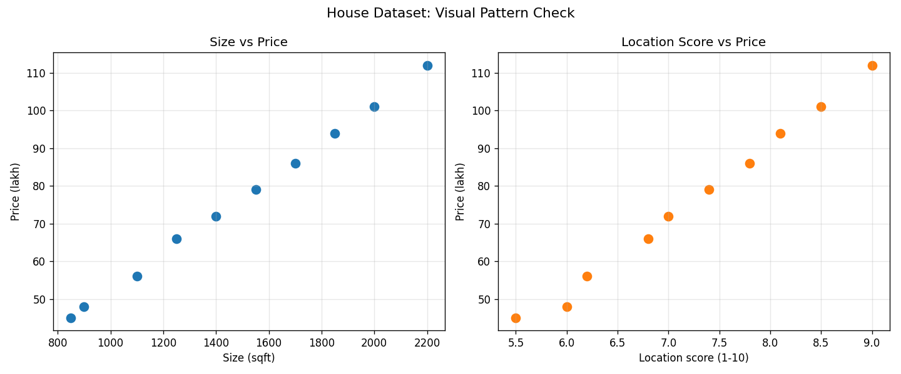

# 02 - Dataset Deep Understanding and Visualization

## 1. Concept

A dataset is a collection of examples.  
Each row is one example (one house), and each column is one property of that example.

In this step, we focus on understanding data before training any model.

- **Features (X):** Inputs we use to learn patterns  
  - `size_sqft`
  - `bedrooms`
  - `location_score`
- **Label (y):** Output we want to predict  
  - `price_lakh`

Simple idea:

- Features = clues
- Label = answer

---

## 2. Table example

Dataset file: `datasets/house_prices_sample.csv`

| house_id | size_sqft | bedrooms | location_score | price_lakh |
|----------|-----------|----------|----------------|------------|
| H01      | 850       | 2        | 5.5            | 45         |
| H02      | 900       | 2        | 6.0            | 48         |
| H03      | 1100      | 2        | 6.2            | 56         |
| H04      | 1250      | 3        | 6.8            | 66         |
| H05      | 1400      | 3        | 7.0            | 72         |
| H06      | 1550      | 3        | 7.4            | 79         |
| H07      | 1700      | 3        | 7.8            | 86         |
| H08      | 1850      | 4        | 8.1            | 94         |
| H09      | 2000      | 4        | 8.5            | 101        |
| H10      | 2200      | 4        | 9.0            | 112        |

---

## 3. Visualization (code)

```python
import csv
import os
import matplotlib.pyplot as plt

DATASET_PATH = "datasets/house_prices_sample.csv"
PLOT_PATH = "docs/images/02-dataset-visualization.png"

rows = []
with open(DATASET_PATH, "r", encoding="utf-8") as file:
    reader = csv.DictReader(file)
    for row in reader:
        rows.append(
            {
                "house_id": row["house_id"],
                "size_sqft": int(row["size_sqft"]),
                "bedrooms": int(row["bedrooms"]),
                "location_score": float(row["location_score"]),
                "price_lakh": float(row["price_lakh"]),
            }
        )

sizes = [row["size_sqft"] for row in rows]
location_scores = [row["location_score"] for row in rows]
prices = [row["price_lakh"] for row in rows]

fig, axes = plt.subplots(1, 2, figsize=(12, 5))

axes[0].scatter(sizes, prices, color="#1f77b4", s=70)
axes[0].set_title("Size vs Price")
axes[0].set_xlabel("Size (sqft)")
axes[0].set_ylabel("Price (lakh)")
axes[0].grid(alpha=0.3)

axes[1].scatter(location_scores, prices, color="#ff7f0e", s=70)
axes[1].set_title("Location Score vs Price")
axes[1].set_xlabel("Location score (1-10)")
axes[1].set_ylabel("Price (lakh)")
axes[1].grid(alpha=0.3)

plt.tight_layout()
os.makedirs("docs/images", exist_ok=True)
plt.savefig(PLOT_PATH, dpi=120)
print("Visualization saved to:", PLOT_PATH)
```

Also available as runnable script: `backend/app/ml/dataset_visualization.py`

---

## 4. Output

Terminal output:

```text
Table view of dataset
---------------------
house_id size_sqft  bedrooms  location_score  price_lakh
--------------------------------------------------------
H01      850        2         5.5             45.0
H02      900        2         6.0             48.0
H03      1100       2         6.2             56.0
H04      1250       3         6.8             66.0
H05      1400       3         7.0             72.0
H06      1550       3         7.4             79.0
H07      1700       3         7.8             86.0
H08      1850       4         8.1             94.0
H09      2000       4         8.5             101.0
H10      2200       4         9.0             112.0

Dataset understanding
---------------------
Total rows: 10
Features (X): ['size_sqft', 'bedrooms', 'location_score']
Label (y): price_lakh
Price range (lakh): 45.0 to 112.0
Average price (lakh): 75.9

Visualization saved to: docs/images/02-dataset-visualization.png
```

Generated graph:



---

## 5. Summary

- We clearly separated **features (X)** and **label (y)**.
- We inspected the dataset in table form to understand rows and columns.
- We plotted scatter graphs to see patterns:
  - As **size_sqft** increases, **price_lakh** generally increases.
  - As **location_score** increases, **price_lakh** also increases.
- This visual understanding is important before building any ML model.
